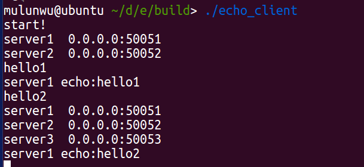

# gRPC-etcd服务发现
## 知识前提：
### 1.grpc相关知识：
官方文档：http://doc.oschina.net/grpc?t=57966
官方GitHub：https://github.com/grpc/grpc
安装教程：https://zhuanlan.zhihu.com/p/53367817

### 2.etcd相关知识：
官方文档：https://doczhcn.gitbook.io/etcd/
官方文档：https://etcd.io/docs/v3.4.0/
etcd-GitHub：https://github.com/etcd-io/etcd
etcd-C++ client GitHub1：https://github.com/maragkose/etcd3-client
etcd-C++ client GitHub1：https://github.com/nokia/etcd-cpp-apiv3
安装教程：https://www.jianshu.com/p/f68028682192

### 3.服务发现相关知识：
https://www.jianshu.com/p/75e1107530b1

## 功能说明：
1.通过gRPC实现echo服务器和客户端之间的通信，同时也是etcd和etcd C++ client之间通信的方式;  
2.多个服务器在etcd集群上注册IP信息供客户端获取并访问，做服务发现;  
3.并利用etcd的一致性存储，完成当有服务器变更时，服务器之间可以做主备切换，客户端也会将自己的访问均衡到新服务器上； 

## 文件说明：
1.src：etcd C++ client接口;  
2.demo：服务发现demo；  

## 运行方式：
 mkdir build  
 cd build  
 cmake ..  
 make
 
然后启动对应的服务器和客户端。

## 展示：
登录服务器，则在集群中自动注册ip信息：  

登录三个服务器，将会在etcd中注册三个key-value键值对，分别对应服务器名和服务器IP：

客户端通过查询etcd，实现对不同服务器的轮询访问（hello为客户端的主动输入，每次发送hello后，会将消息发送给不同的server）：  

当有新的服务器添加时，客户端更新服务器集群的信息，做简单的负载均衡（之前只有server1和server2，当加入新的server3后，client发送新的消息时，就会重新检查服务器表）：  

一个服务器挂掉，会有新的同key值服务器将其顶替，实现主备切换（首先一直运行一个备用服务器（ip为50054）。原本的server3 ip为50053，当这个服务器挂掉之后，备用服务器就会自动顶替之前的server3）：  

（etcd C++ API参考GitHub：https://github.com/maragkose/etcd3-client）
